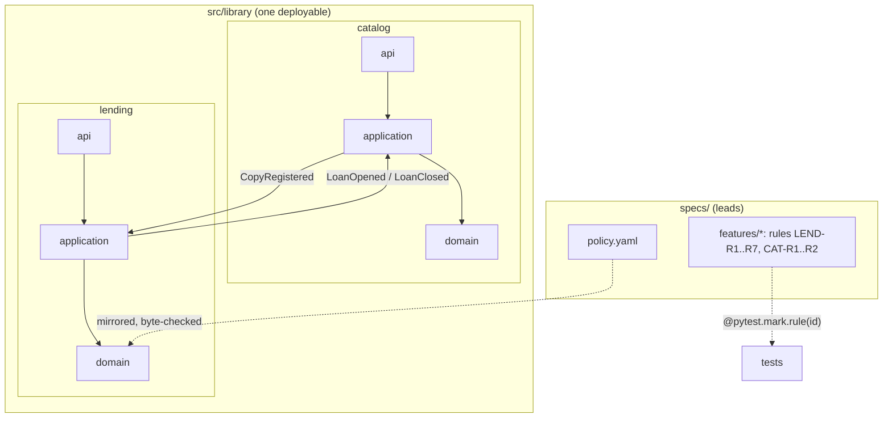

# Spec-driven DDD — a modular monolith in miniature

[](https://github.com/hasanozkan/spec-driven-ddd-python/actions/workflows/ci.yml)
 

A small library-lending system that exists to show **how** software gets
built when the specification leads and the architecture is enforced by the
build — not the size of the system.

The domain is deliberately familiar (books, copies, members, loans, late
fees) so the interesting parts are the ones around it:

- **Specs lead.** Behaviour is written first as numbered rules
  ([`specs/features/`](specs/features)); code and tests cite those ids.
- **Bounded contexts that cannot leak.** `catalog` and `lending` never import
  each other; they exchange integration events. A build failure, not a wiki page.
- **Rules as plain functions.** The domain layer has no framework, no
  repository, no clock — every rule is a unit test away.
- **Single source for policy.** Loan limits and fees live in
  [`specs/policy.yaml`](specs/policy.yaml); the code carries a mirror that the
  build checks byte for byte.
- **Traceability that fails.** Every spec rule must have a test tagged with
  its id, and every tag must name a real rule.
- **Contracts in review.** The OpenAPI document is a committed snapshot; an
  API change without it fails CI.



## Quickstart

```sh
make install     # uv sync
make check       # every gate CI runs
make run         # http://127.0.0.1:8000/docs
docker build -t library-sample . && docker run -p 8000:8000 library-sample
```

Every merge to `main` publishes `ghcr.io/hasanozkan/library-sample:main-<unix-ts>-<sha>`,
which [gitops-reference](https://github.com/hasanozkan/gitops-reference) deploys.

## The gates, and what each one proves

| `make …` | Fails when |
|---|---|
| `imports` | a context imports another · a layer imports upwards · the domain imports FastAPI/Pydantic |
| `mirror` | the code's policy differs from `specs/policy.yaml` |
| `trace` | a spec rule has no test · a test cites a rule no spec defines |
| `test` | a rule does not hold |
| `contracts` | the API changed but `contracts/openapi.json` did not |
| `lint`, `types` | ruff, strict mypy |
| CI `secrets` | gitleaks finds a secret in history |

Each gate was verified by breaking it on purpose once — a cross-context
import, a framework in the domain, a drifted policy, an untagged rule, an
unsnapshotted route, a removed fee cap. All six turned the build red.

## Tour

| Path | What to look at |
|---|---|
| [`docs/workflow.md`](docs/workflow.md) | The order of work: spec → decision → slice → gate, DoR / DoD |
| [`docs/adr/`](docs/adr) | Why a modular monolith, why events between contexts, why policy is data |
| [`specs/domain/`](specs/domain) | Bounded contexts and the ubiquitous language |
| [`src/library/lending/domain/rules.py`](src/library/lending/domain/rules.py) | The rules, each naming its spec id |
| [`src/library/contracts/events.py`](src/library/contracts/events.py) | The only thing the contexts share |
| [`src/library/app.py`](src/library/app.py) | The composition root — the one place that knows every context |
| [`scripts/`](scripts) | The trace, mirror and contract checks (a few dozen lines each) |
| [`AGENTS.md`](AGENTS.md) | The same rules, written for an AI coding agent |

## Deliberate simplifications

In-memory repositories and a synchronous in-process event bus. In a
production system the repositories would sit on a database and events would
leave through a transactional outbox to a broker — the domain, the use cases
and the contracts would not change. That is the point of the boundaries.

---

Built by [Hasan Özkan](https://github.com/hasanozkan). The patterns here come
from building a production product with spec-driven, agent-assisted
development; this repository is an independent, from-scratch illustration of
them.
