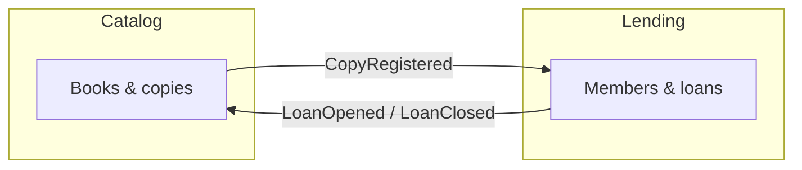

# Bounded contexts

Two contexts, one deployable. Each owns its data and its language; they never
depend on each other (the build enforces it) and talk only through the
integration events of the shared contracts.

| Context | Owns | Publishes | Listens to |
|---|---|---|---|
| **Catalog** | Books (ISBN, title, author) and physical copies; what a reader can find | `CopyRegistered` | `LoanOpened`, `LoanClosed` — to show availability |
| **Lending** | Members, tiers, loans, due dates, late fees | `LoanOpened`, `LoanClosed` | `CopyRegistered` — to know a copy exists |

Why the split sits here: "availability" means two different things. For a
reader browsing the catalog it is a *view* ("2 of 3 copies on the shelf").
For lending it is an *invariant* ("this copy cannot be lent twice"). The
invariant lives with the loan, where it is decided; the view is a projection.
